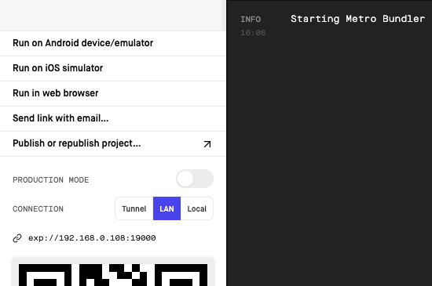

# ECG Frontend

frontend do projeto [EcgRemoto](https://github.com/MarceloSkank/ECGRemote)

### Tecnologias Utilizadas
- Expo
- NPM

### Instalação
- Instalar [NodeJS](https://nodejs.org/en/download/)
- Instalar Expo
```bash
npm install --global expo-cli
```
- Faca o Clone do projeto

```bash
git clone https://github.com/MarceloSkank/ECGFrontEnd
```
- na pasta do projeto instale as dependencias do mesmo
```bash
npm install
```
- então inicie o projeto
```bash
expo start
```
- ira abrir esta janela no seu navegador onde voce pode rodar o seu projeto 


- Para rodar o projeto em versao WEB é so clicar em "Run in Web Bowser"

### Para rodar o projeto em android e IOS com o EXPO GO
- Crie sua conta no Site da [EXPO](https://expo.io/)
- Baixe o App EXPO GO no seu Smartphone
- no seu Terminal rode o comando
```bash
expo login
```
- faca o login tambem no APP e poderá testar o projeto em smartphones
